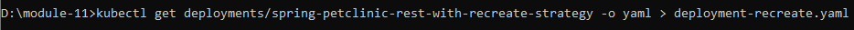

# Reflection on Hello Minikube

1. log menjadi lebih banyak, contohnya menggunakan method GET
2. **kubectl get** memberikan informasi mengenai suatu objek, seperti pod, deployment, dan lain-lain tergantung permintaan, sedangkan -n <namespace> akan memberikan informasi yang diinginkan dalam namespace tertentu.

# Reflection on Rolling Update & Kubernetes Manifest File
1. rolling update memastikan deployment update terjadi dengan zero downtime dengan cara secara incremental mengganti pods sekarang dengan yang baru. Kubernetes akan menunggu new pods untuk jalan terlebih dahulu sebelum menghapus pods lama. 
Recreate deployment strategy berbeda dengan rolling update, di mana strategy ini merupakan all-or-nothing process, yaitu melakukan update secara langsung dengan beberapa downtime. Strategi nya yaitu pods yang ada pada deployemnt akan dihentikan langsung dan akan langsung diganti dengan yang baru.
2. 
 
Terlihat strategynya masih rolling update. Ubah strategynya ke recreate.

3. 

4. menggunakan kubernetes manifest files sangat memudahkan deployment karena mudah untuk mengatur/mengubah setiap pengaturan. Filenya mudah dibaca untuk manusia dan tinggal apply deployment dengan perintah **kubectl apply**. Sekalin itu juga manifest file tentunya mudah untuk dishare.

